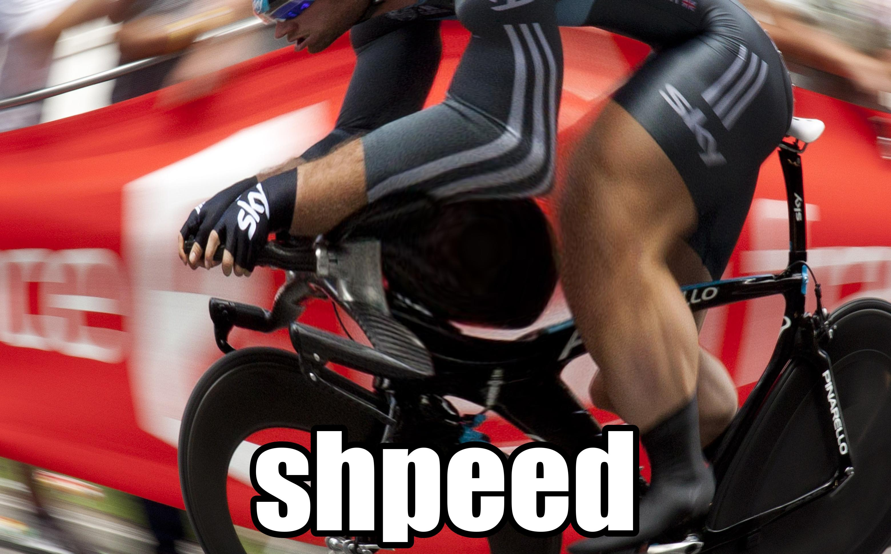
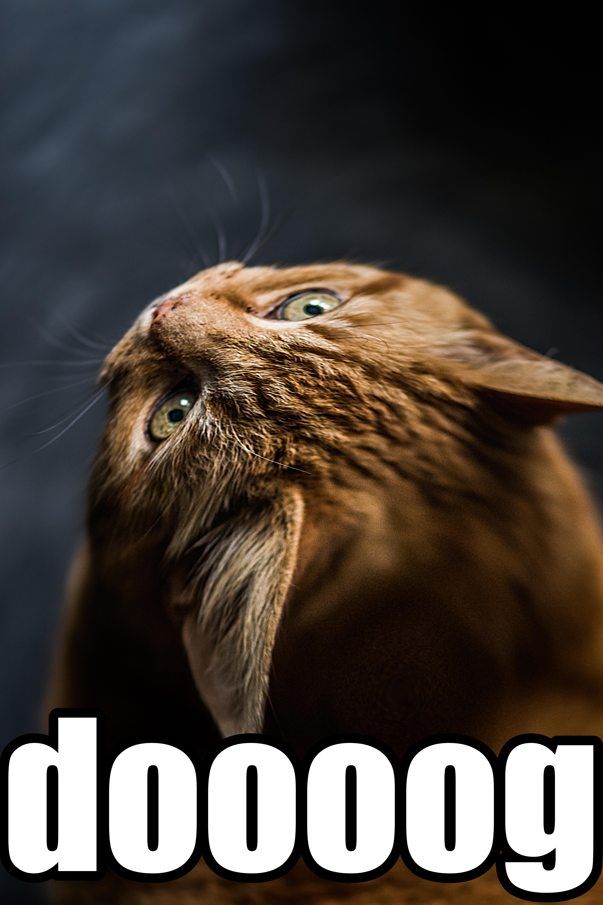
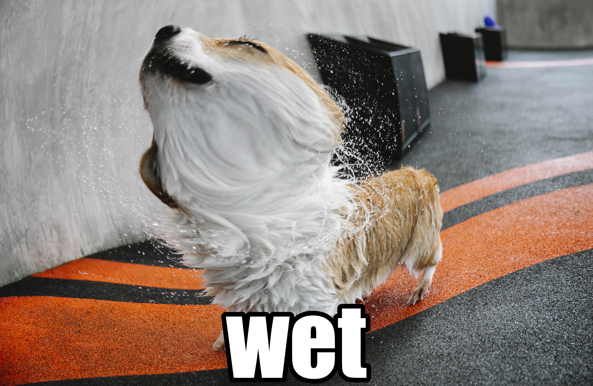
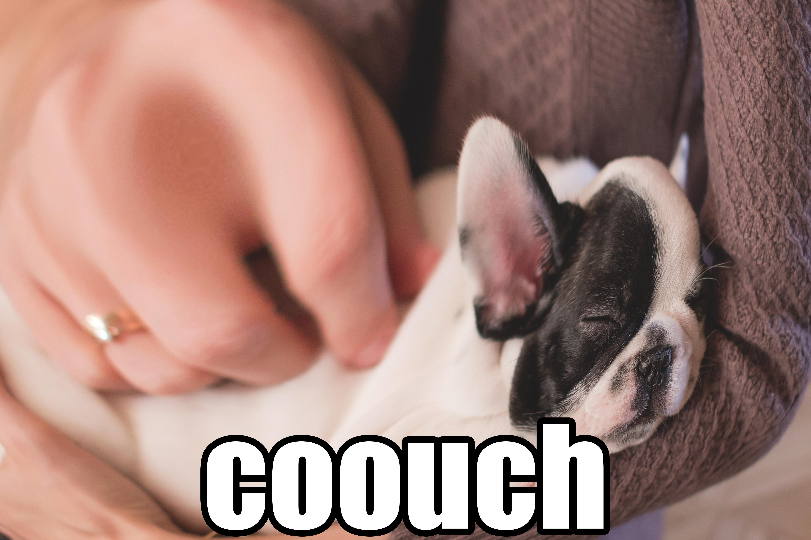
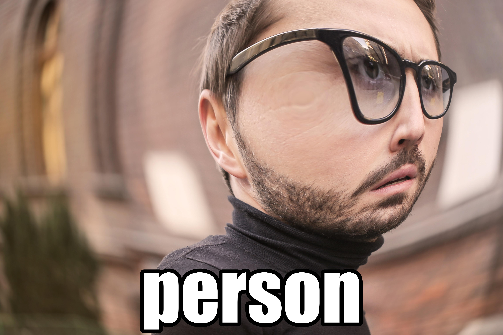
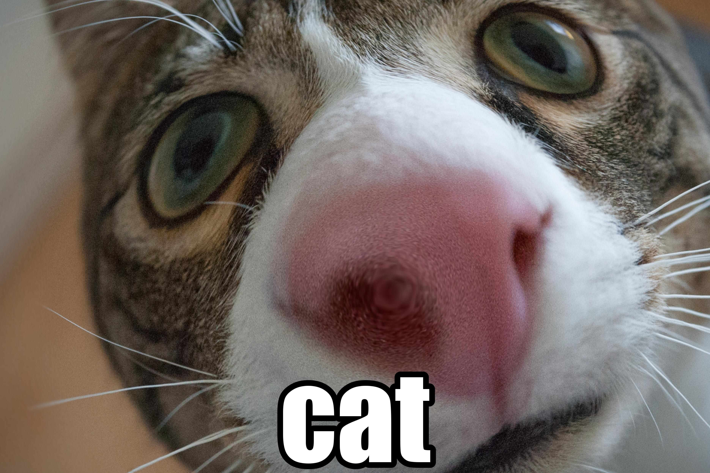
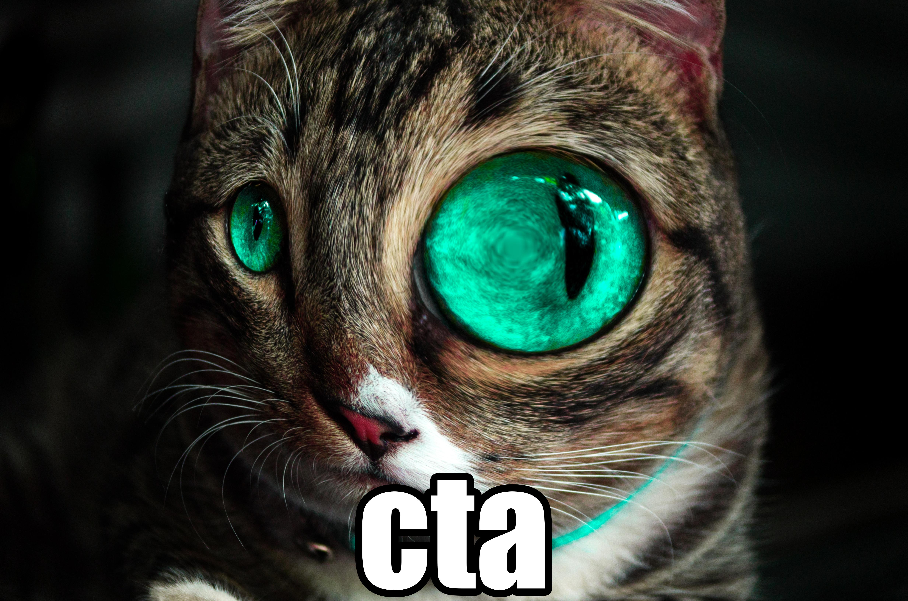
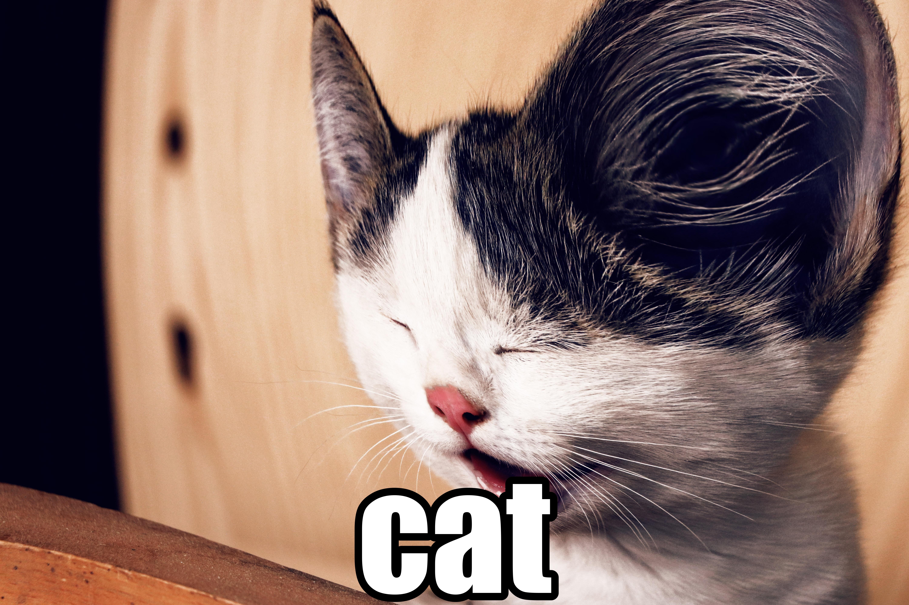
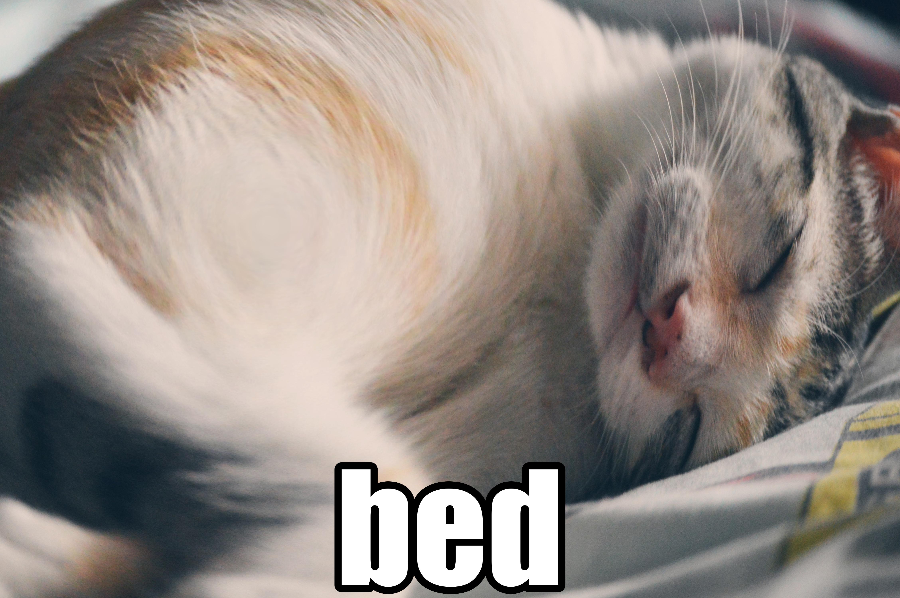

# 2020s Humor Bot
2020s Humor Bot is a python based twitter bot which takes a random image out of a folder, makes it stupid, and posts it to twitter.

When it runs, the ImageAI library is used to identify what is in the image, a hand-built stupification algorithm is applied to the name of the object, the image is distorted at the location of the object, the stupified name of the object is placed on the image in a recognizable meme font, and finally, the image is tweeted via the EasyTweeter library.

## Examples
Below are some examples of it's output, pretty well covering the gamut of humor, quality, and stupidity.

## Installing the Bot
If you want to spin up a competing twitter account of your own with the bot, it can be installed and run a couple of ways.

### Pip
If you have python 3 installed, pip is an easy way to acquire the bot, just run the following: `pip install TwentyTwentiesHumorBot`

### Binary
If you don't have python installed, or don't want to use your python installation for whatever reason, you can download the binary for your OS of choice from the releases page, and run that like you would run a command line program as usual in that environment.

Because of the way Windows packages their EXEs, there's two versions, one which logs to stdout/stderr as usual, and one which doesn't (the _headless version), intended for running in the background via scheduled tasks.

### Running from Source
Given that the bot is in python, running from source is easy if it's dependencies are available.

If you want to install the dependencies yourself, run `pip install -r requirements.txt`, and then `setup.py install` to install the bot itself.

Once dependencies are available, the TwentyTwentiesHumorBot package can be executed, since __main__.py is present.

## Running the Bot
Because of potential licensing issues and file size constraints, a fair amount of data the bot needs can't (or shouldn't) be distributed with it.

### Provide Data
Input images should be placed in the `input` directory inside the bot's home directory (see below for more on the location of this directory).

Any images can be used, but the canonical instance of the bot uses image downloaded from Pexels (via the downloader script in the PexelsDownloader folder), because the licensing of that website does not require attribution.

### Provide a Model for ImageAI
As object detection is used to identify what kind of object is in the image, an AI model is required. It should be placed in the `model` directory within the bot's home directory. Only a single file should be placed there at a time.

The model is available in the [ImageAI documentation](https://github.com/OlafenwaMoses/ImageAI/blob/master/imageai/Detection/README.md).

### Provide a Font
The impact font which is used to label the memes is installed with many modern operating systems, and it should be copied into the `font` directory inside the bot's home directory.

### Provide Credentials
The file `credentials.ini` should be present in the bot's home directory, and it should contain the authentication information for twitter so the bot can post.

This file is in the format expected by [EasyTweeter](https://github.com/HelloLobsterDog/EasyTweeter).

### Running
Once the prerequisites are available, running the bot is as simple as running `TwentyTwentiesHumorBot` in your shell of choice.

#### Command Line Arguments
The following command line arguments are available (all optional):

 - `--home-directory`: provide a directory to override the default. If the directory does not exist, it will create it. Defaults to `~/.2020sHumorBot/`
 - `--log-level`: override the default log level. Accepts: `NOT_SET`, `DEBUG`, `INFO`, `WARNING`, `ERROR`, `CRITICAL`. Defaults to `INFO`
 - `--verbose` (or `-v`): logs all output to stdout, in addition to log files (this is the default). Mutually exclusive with --quiet.
 - `--quiet` (or `-q`): disables all logging to stdout/stderr. All logging to the log files will be unaffected. Mutually exclusive with --verbose.
 - `--curation` (or `-c`): Runs all of the images in the home_dir/curation/input through the bot so you can see the output, without making any posts to twitter. Useful for ensuring the images you're giving the bot will work and be high quality.
 - `--include-curation` (or `-ic`): will run one full execution of the bot as usual, and then the curation explained above.